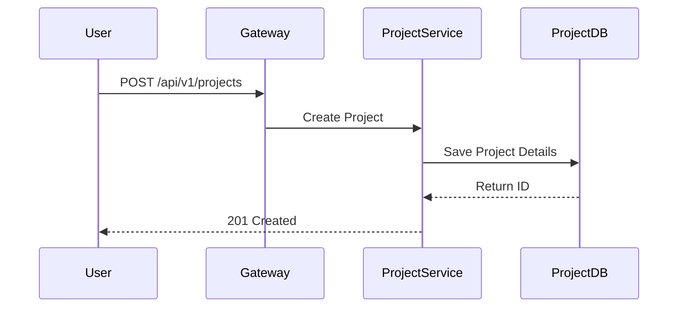

# 📂 Project Service

The Project Service allows developers to showcase their portfolios, open-source work, and collaborative projects.

## 🏗️ Architecture Flow

## 🔑 Key Responsibilities
- **Project Portfolios**: Managing the CRUD operations for developer projects.
- **Collaboration**: Linking multiple members to a single project.
- **Showcase**: Fetching lists of projects by tech stack, popularity, or owner.

## ⚙️ Environment Variables
Required variables in `.env`:
- `PROJECT_DB_URL`
- `PROJECT_DB_USERNAME`
- `PROJECT_DB_PASSWORD`

## 🛠️ Tech Stack
- **Database**: PostgreSQL (`project_db`)
- **Port**: `8084`
